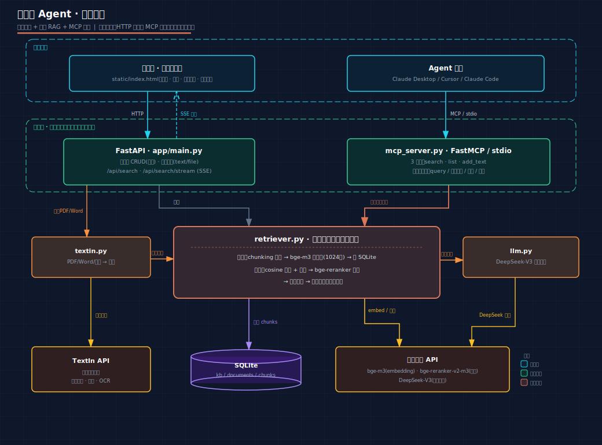

<div align="center">

# 🔍 知识库 Agent

**语义检索知识库 · 流式 RAG · MCP 工具**

让 Agent 调用本地知识库做语义检索与流式问答的端到端系统


</div>

> 核心亮点：**HTTP 接口与 MCP 工具共享同一个检索内核**——一份检索逻辑，既给网页用，也给 Agent 用。

<div align="center">

</div>

---

## ✨ 功能特性（对照需求）

**知识库**
- ✅ 知识库增删改查，**带分页**
- ✅ 上传知识内容：直接输入文本 / 上传文件（**txt·md 直读；PDF·Word·图片走 TextIn 解析**）
- ✅ 相关性查询：**bge-m3 向量召回 → bge-reranker 精排**两阶段语义检索
- ✅ **SSE 流式返回**：先发命中来源，再像 DeepSeek 一样逐字蹦出回答

**Agent 工具化**
- ✅ 检索能力封装为 **MCP server**（FastMCP / stdio），可被 Claude Desktop / Cursor / Claude Code 直接调用
- ✅ 三个工具：`search_knowledge_base` / `list_knowledge_bases` / `add_text_to_kb`
- ✅ 完善错误处理：query 空 / 知识库不存在 / 检索失败 / 调用超时——均返回可读文本，**不抛裸异常**

---

## 🚀 快速开始

```bash
# 1. 配置：复制 .env.example 为 .env，填入硅基流动 key（必填）
cp .env.example .env

# 2. 安装依赖
pip install -r requirements.txt

# 3. 启动
uvicorn app.main:app
```

浏览器打开 **http://localhost:8000/** 即交互页。详见 [运行说明.md](运行说明.md)。

---

## 🧱 技术栈

| 层 | 选型 |
|---|---|
| Web 框架 | FastAPI（原生异步 + SSE） |
| 存储 | SQLite（embedding 以 JSON 存储 + numpy 算 cosine，零扩展依赖） |
| 向量 / 精排 / 生成 | 硅基流动：`bge-m3`（1024 维）/ `bge-reranker-v2-m3` / `DeepSeek-V3`（流式） |
| 文档解析 | TextIn 通用文档解析（版面分析 + 表格 + OCR，多模态加分路径） |
| Agent 工具 | FastMCP（官方 MCP Python SDK），stdio 传输 |
| 前端 | 单文件 `static/index.html`（浅色主题 + 拖拽上传，**零构建**） |

---

## 🔌 接入 Agent（MCP）

**Claude Code（一行命令）**
```bash
claude mcp add kb-agent -- python <绝对路径>/mcp_server.py
```

**Claude Desktop / Cursor**（前端「🔌 接入 Agent」面板可一键复制）
```json
{ "mcpServers": { "kb-agent": { "command": "python", "args": ["<绝对路径>/mcp_server.py"] } } }
```

重启后对 Agent 说「帮我查微信小程序 AI 化有哪些不同观点」，它会自动检索本地知识库并作答。

---

## 🧪 测试

附**设计好的测试集**与**自动评测脚本**：

- [TEST_DESIGN.md](TEST_DESIGN.md) — 测试方案设计（参考 BEIR / RAGAS：qrels 分级标注、能力清单、指标、两阶段）
- [测试操作手册.md](测试操作手册.md) — 手动逐条执行指南
- `scripts/run_tests.py` — 自动评测脚本，一键跑完 T1–T8 输出 `联调结果.md`

覆盖：基础语义召回、**真语义≠关键词**、跨文体召回、意图区分、抗干扰精准、多库隔离、**多源综合（对立观点）**、**拒答不编造**、错误处理、Agent 工具调用、多模态文档解析。

---

## 🧩 扩展：有据写作 Skill

`skill/kb-grounded-writer/SKILL.md` —— 一个**建立在 MCP 之上**的写作 Skill：调用 `search_knowledge_base` 检索本地语料，**有料才按头部 AI 公众号 IP 风格写、且只依据真实素材不编造（标来源）；无料则直接拒写并提示先上传资料**。默认全库检索。展示"检索能力被 Agent 复用"的延伸。

---

## 📁 目录结构

```
app/                      后端（config/db/embedder/chunking/textin/retriever/llm/schemas/main）
mcp_server.py             MCP server（3 个工具）
static/index.html         前端交互页（浅色主题 + 拖拽上传 + 引导）
scripts/run_tests.py      自动评测脚本
skill/kb-grounded-writer/ 扩展：有据写作 Skill（建立在 MCP 之上）
架构图.svg                系统架构图
TEST_DESIGN.md            测试方案设计
测试操作手册.md            手动测试指南
.env.example              配置模板（真实 .env 不入库）
```

---

<div align="center">

作者：杜亮宽 · 2026　|　License: MIT

</div>
